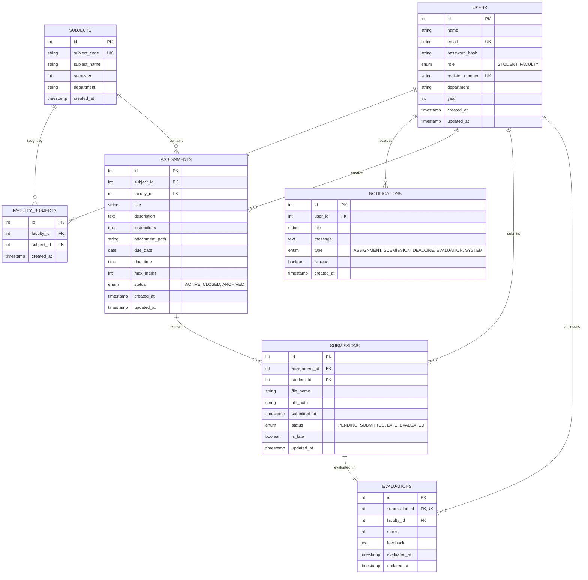

# Database Design & Relational Schema Specification

## 1. Relational Database Overview

- **Database Engine**: MySQL 8.0+
- **Storage Engine**: InnoDB (ACID compliant, transaction support, foreign key constraint enforcement)
- **Character Set**: `utf8mb4`
- **Collation**: `utf8mb4_unicode_ci`
- **Schema Name**: `assignment_manager`

---

## 2. Entity-Relationship Diagram (ERD)



---

## 3. Data Dictionary

### Table 1: `users`
| Column | Data Type | Constraints | Description |
|---|---|---|---|
| `id` | `INT` | PRIMARY KEY, AUTO_INCREMENT | Unique user identifier |
| `name` | `VARCHAR(100)` | NOT NULL | User's full academic name |
| `email` | `VARCHAR(150)` | NOT NULL, UNIQUE | User login email address |
| `password_hash`| `VARCHAR(255)` | NOT NULL | One-way BCrypt password hash |
| `role` | `ENUM('STUDENT','FACULTY')` | NOT NULL | Role-based authorization principal |
| `register_number` | `VARCHAR(50)` | UNIQUE, NULLABLE | Student university registration number |
| `department` | `VARCHAR(100)` | NOT NULL | Academic engineering department |
| `year` | `INT` | NULLABLE | Student academic year (1-5) |
| `created_at` | `TIMESTAMP` | DEFAULT CURRENT_TIMESTAMP | Account creation time |
| `updated_at` | `TIMESTAMP` | AUTO-UPDATE TIMESTAMP | Last profile update time |

### Table 2: `subjects`
| Column | Data Type | Constraints | Description |
|---|---|---|---|
| `id` | `INT` | PRIMARY KEY, AUTO_INCREMENT | Subject identifier |
| `subject_code` | `VARCHAR(20)` | NOT NULL, UNIQUE | Course code (e.g. `CS8501`) |
| `subject_name` | `VARCHAR(150)` | NOT NULL | Full course title |
| `semester` | `INT` | NOT NULL | Semester curriculum level (1-8) |
| `department` | `VARCHAR(100)` | NOT NULL | Hosting department |

### Table 3: `faculty_subjects`
| Column | Data Type | Constraints | Description |
|---|---|---|---|
| `id` | `INT` | PRIMARY KEY, AUTO_INCREMENT | Mapping identifier |
| `faculty_id` | `INT` | NOT NULL, FK(`users.id`) ON DELETE CASCADE | Faculty user ID |
| `subject_id` | `INT` | NOT NULL, FK(`subjects.id`) ON DELETE CASCADE | Mapped subject ID |

### Table 4: `assignments`
| Column | Data Type | Constraints | Description |
|---|---|---|---|
| `id` | `INT` | PRIMARY KEY, AUTO_INCREMENT | Assignment identifier |
| `subject_id` | `INT` | NOT NULL, FK(`subjects.id`) | Course subject |
| `faculty_id` | `INT` | NOT NULL, FK(`users.id`) | Authoring faculty member |
| `title` | `VARCHAR(200)` | NOT NULL | Assignment task title |
| `description` | `TEXT` | NOT NULL | Problem statement and summary |
| `instructions` | `TEXT` | NULLABLE | Detailed guidelines and rubric |
| `attachment_path`| `VARCHAR(255)` | NULLABLE | Server path to course material |
| `due_date` | `DATE` | NOT NULL | Submission cutoff date |
| `due_time` | `TIME` | NOT NULL DEFAULT '23:59:00' | Submission cutoff time |
| `max_marks` | `INT` | NOT NULL DEFAULT 100 | Maximum points |
| `status` | `ENUM('ACTIVE','CLOSED','ARCHIVED')` | DEFAULT 'ACTIVE' | Lifecycle state |

### Table 5: `submissions`
| Column | Data Type | Constraints | Description |
|---|---|---|---|
| `id` | `INT` | PRIMARY KEY, AUTO_INCREMENT | Submission record ID |
| `assignment_id` | `INT` | NOT NULL, FK(`assignments.id`) ON DELETE CASCADE | Associated assignment |
| `student_id` | `INT` | NOT NULL, FK(`users.id`) ON DELETE CASCADE | Submitting student |
| `file_name` | `VARCHAR(255)` | NOT NULL | Original upload filename |
| `file_path` | `VARCHAR(255)` | NOT NULL | Safe server storage path |
| `submitted_at` | `TIMESTAMP` | DEFAULT CURRENT_TIMESTAMP | Submission timestamp |
| `status` | `ENUM(...)` | DEFAULT 'SUBMITTED' | `PENDING`, `SUBMITTED`, `LATE`, `EVALUATED` |
| `is_late` | `BOOLEAN` | DEFAULT FALSE | Late flag calculated by server |

### Table 6: `evaluations`
| Column | Data Type | Constraints | Description |
|---|---|---|---|
| `id` | `INT` | PRIMARY KEY, AUTO_INCREMENT | Evaluation ID |
| `submission_id` | `INT` | NOT NULL, UNIQUE, FK(`submissions.id`) ON DELETE CASCADE | Associated submission |
| `faculty_id` | `INT` | NOT NULL, FK(`users.id`) | Grading faculty member |
| `marks` | `INT` | NOT NULL | Awarded marks (`0 <= marks <= max_marks`) |
| `feedback` | `TEXT` | NULLABLE | Qualitative remarks |
| `evaluated_at` | `TIMESTAMP` | DEFAULT CURRENT_TIMESTAMP | Grading timestamp |

### Table 7: `notifications`
| Column | Data Type | Constraints | Description |
|---|---|---|---|
| `id` | `INT` | PRIMARY KEY, AUTO_INCREMENT | Notification ID |
| `user_id` | `INT` | NOT NULL, FK(`users.id`) ON DELETE CASCADE | Target recipient |
| `title` | `VARCHAR(150)` | NOT NULL | Alert title |
| `message` | `TEXT` | NOT NULL | Alert description |
| `type` | `ENUM(...)` | `ASSIGNMENT`, `SUBMISSION`, `DEADLINE`, `EVALUATION`, `SYSTEM` | Alert category |
| `is_read` | `BOOLEAN` | NOT NULL DEFAULT FALSE | Read/unread flag |

---

## 4. Indexing Strategy & Performance Rationale

```sql
CREATE INDEX idx_users_email ON users(email);
CREATE INDEX idx_users_reg_no ON users(register_number);
CREATE INDEX idx_assignments_subject ON assignments(subject_id);
CREATE INDEX idx_assignments_faculty ON assignments(faculty_id);
CREATE INDEX idx_assignments_due_date ON assignments(due_date);
CREATE INDEX idx_submissions_assignment ON submissions(assignment_id);
CREATE INDEX idx_submissions_student ON submissions(student_id);
CREATE INDEX idx_submissions_status ON submissions(status);
CREATE INDEX idx_evaluations_submission ON evaluations(submission_id);
CREATE INDEX idx_notifications_user_read ON notifications(user_id, is_read);
```

- **`idx_users_email` & `idx_users_reg_no`**: Enables $O(1)$ fast lookups during authentication and AJAX duplicate checking.
- **`idx_assignments_due_date`**: Accelerates dashboard queries that sort upcoming and overdue assignments.
- **`idx_notifications_user_read`**: Composite index optimizing unread notification counts (`WHERE user_id = ? AND is_read = FALSE`).
